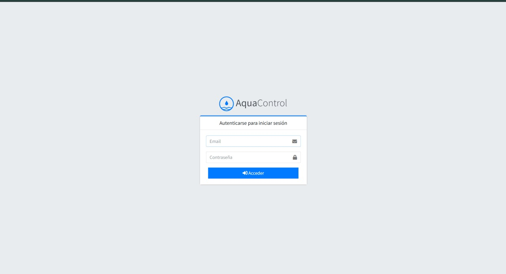
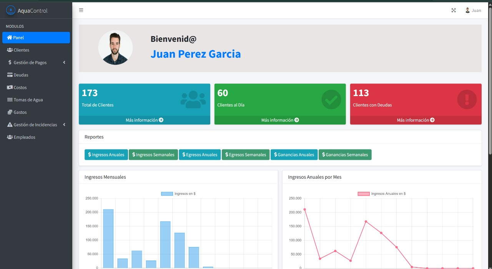

## Welcome to the AquaControl Repository 💧


## AquaControl
A system for water management in a community that helps maintain customer control and, in turn, offer high-quality services and a better experience for local users.

## Preview



### Prerequisites 📋
To run this project, you will need:

- PHP server (XAMPP, WAMP, LAMP)
- **Visual Studio Code** text editor (optional)
- [Composer](https://getcomposer.org/) (dependency manager for PHP)

### Local Installation 🔧💻
1. Go to the GitHub repository: [AquaControl on GitHub](https://github.com/temolzin/AquaGeneric/)

2. Click the **Code** button and copy the link to clone the repository.

3. Open your terminal and navigate to the folder where you want to clone the project.

4. Run the following command:

    ```bash
    git clone https://github.com/temolzin/AquaGeneric.git
    ```

5. Enter the project folder:

    ```bash
    cd AquaGeneric
    ```

6. Install PHP dependencies with Composer:
    ```bash
    composer install
    ```

7. Copy the `.env.example` file and rename it to `.env`.

8. Open the `.env` file and configure the database name and other variables if necessary.

9. Create a database with the same name configured in the `.env` file.

10. Run the migrations and seeders:

    ```bash
    php artisan migrate --seed
    ```

11. Make sure the `gd` extension is enabled in the `php.ini` file. Uncomment this line if it's commented:

    ```
    extension=gd
    ```

12. Generate the application key:

    ```bash
    php artisan key:generate
    ```

13. Install AdminLTE files:

    ```bash
    php artisan adminlte:install
    ```

14. Restore the original repository state:

    ```bash
    git reset --hard
    ```

15. Make sure the MySQL module is running if you're using a server like XAMPP.

16. Finally, start the server:

    ```bash
    php artisan serve
    ```

    Open the URL shown in the console (usually http://127.0.0.1:8000).

## Environment Variables 

To ensure the system works correctly, you must configure the following variables in your `.env` file. These are crucial for the application's core functionalities:

### Captcha Settings
*   **`NOCAPTCHA_SITEKEY`**, **`NOCAPTCHA_SECRET`**: Fill in your Google reCAPTCHA keys. These are required to protect your login and registration forms from automated bot attacks and spam.

### Mail Configuration
*   **`MAIL_HOST`**, **`MAIL_PORT`**, **`MAIL_USERNAME`**, **`MAIL_PASSWORD`**: Provide your SMTP server details. This allows the system to send critical notifications, service alerts, and password recovery emails to users.

### Communication Settings
*   **`WHATSAPP_NUMBER`**: Enter the administration's phone number in international format. This number is used to generate direct contact links so users can reach support via WhatsApp.
*   **`CONTACT_FORM_TO_EMAIL`**: Specify the email address where you want to receive inquiries. All messages submitted through the website's contact form will be forwarded to this address.

## Additional Commands

- **Manual Migrations**:
    ```bash
    php artisan migrate
    ```
- **Manual Seeders**:
    ```bash
    php artisan db:seed
    ```
- **Run Queue Worker** (to process background jobs like emails, notifications, etc.):
    ```bash
    php artisan queue:work
    ```